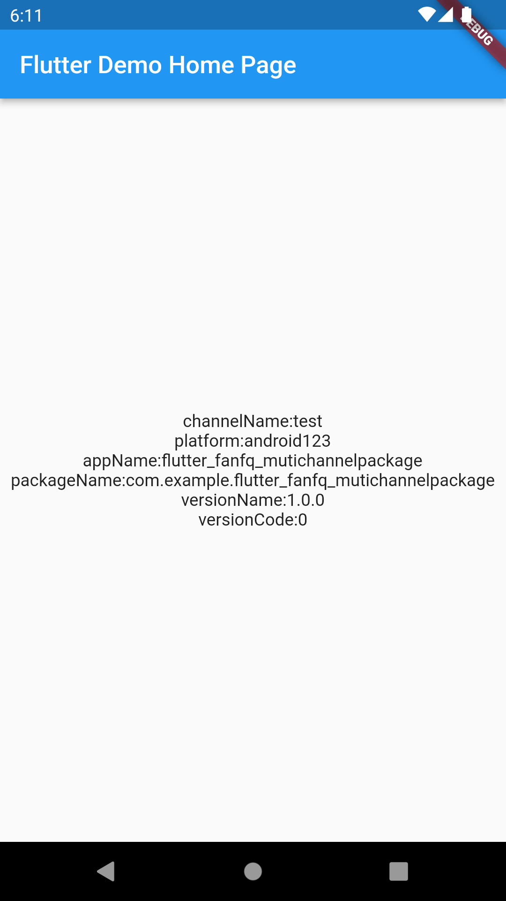
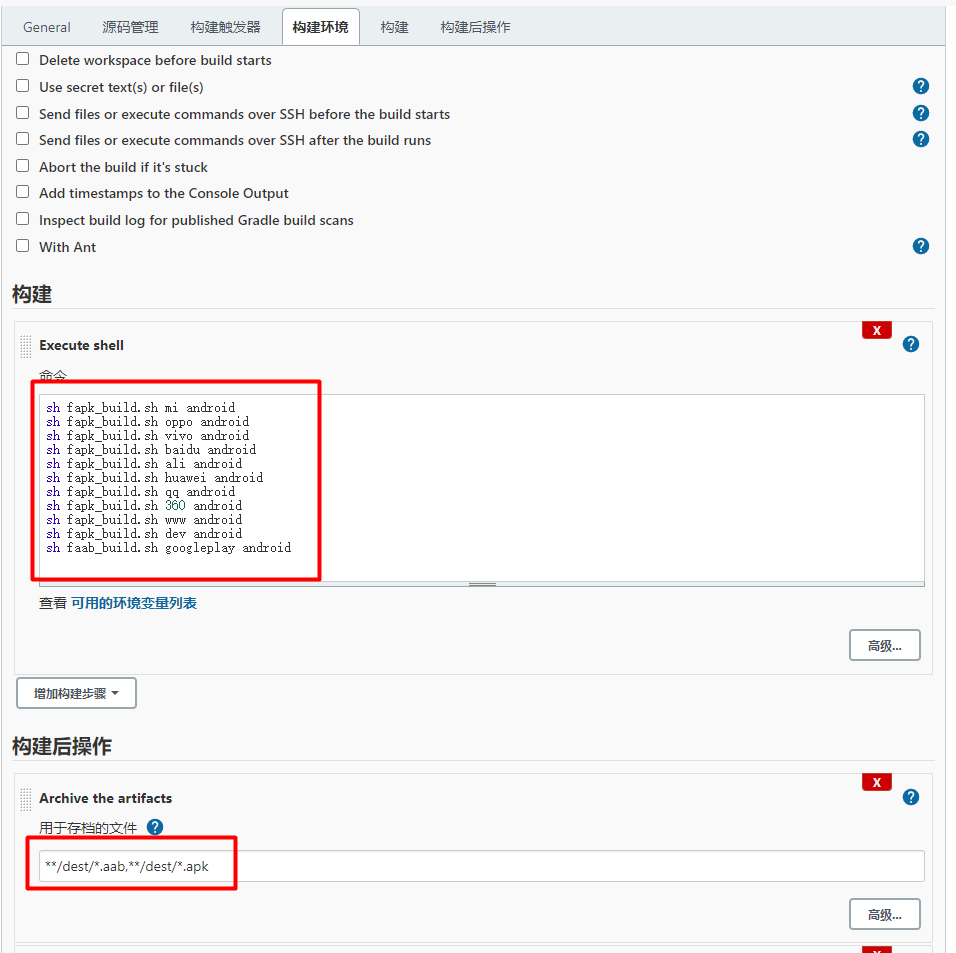
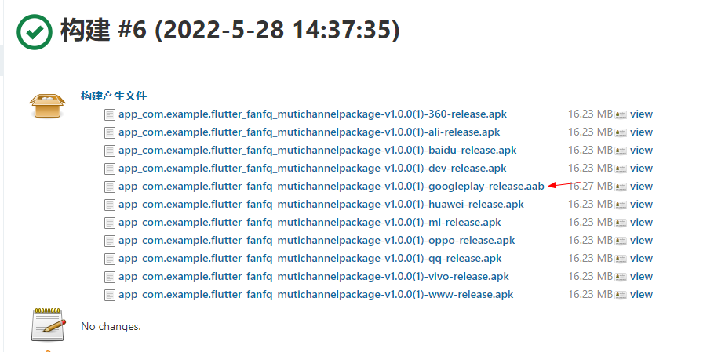

# flutter_fanfq_mutichannelpackage

A new Flutter project.

## Getting Started

## depends

[package_info_plus](https://pub.dev/packages/package_info_plus)

```yaml

  package_info_plus: ^1.4.2
  
```

```dart

  late String channelName = "";
  late String platform = "";
  late String appName = "";
  late String packageName = "";
  late String versionName = "";
  late int versionCode = 0;

  init() async{
    //获取包体信息
    PackageInfo packageInfo = await PackageInfo.fromPlatform();

    setState((){
      channelName = EnvironmentConfig.CHANNEL_NAME;
      platform = EnvironmentConfig.PLATFORM;

      appName = packageInfo.appName;
      packageName = packageInfo.packageName;
      versionName = packageInfo.version;
      versionCode = int.fromEnvironment(packageInfo.buildNumber,defaultValue: 0);
    });

  }

  @override
  void initState(){
    super.initState();
    init();
  }

```

## preview

```shell

flutter run --dart-define=CHANNEL_NAME=test --dart-define=PLATFORM=android123

```




## build

```shell

//for .abb
./faab_build.sh googleplay android

//for .apk
./fapk_build.sh channelname android

//for ipa
./fios_build.sh appstore ios

//for muti-channel
./fapk_build.sh mi android
./fapk_build.sh oppo android
./fapk_build.sh vivo android
./fapk_build.sh baidu android
./fapk_build.sh ali android
./fapk_build.sh huawei android
./fapk_build.sh qq android
./fapk_build.sh 360 android
./fapk_build.sh www android
./fapk_build.sh dev android

```

## jenkins





## setup

`android/app/build.gradle`

```groovy

/// 获取渠道参数使用,这里设置一下默认值
def dartEnvironmentVariables = [
        CHANNEL_NAME: 'googleplay',
        PLATFORM: 'android',
]
if (project.hasProperty('dart-defines')) {
    dartEnvironmentVariables = dartEnvironmentVariables + project.property('dart-defines')
            .split(',')
            .collectEntries { entry ->
                // 1.22.6 版本
                //def pair = URLDecoder.decode(entry).split('=')
                // 2.2 版本
                def pair = new String(entry.decodeBase64(), 'UTF-8').split('=')
                [(pair.first()): pair.last()]
            }
}

...


android {
    defaultConfig {
        ...

        //编译包命名
        setProperty("archivesBaseName", "app_${applicationId}-v${versionName}(${versionCode})-${dartEnvironmentVariables.CHANNEL_NAME}")
    }
    ...
}
...

```


## 参考文献

[Flutter 中如何优雅的实现多渠道打包（埋点统计系列）](https://juejin.cn/post/6949901619689586719)